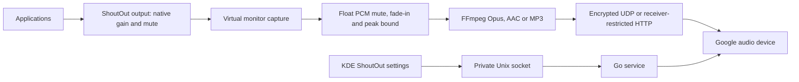

# Implementation plan

## Implemented architecture

The Go service owns discovery, Cast session control, persistence and supervision. A small Qt6/KDE Frameworks module supplies the native ShoutOut System Settings page; the audio device itself uses KDE's existing audio backend.

A stable owned null sink survives service restarts to preserve routing and native gain/mute. Capture is pinned to its monitor and marked virtual. Native mute is mirrored to the receiver; volume is applied once by the audio server, with independent user-selected receiver scaling. New connections verify muted receiver volume before enabling non-silent PCM.

Cast Streaming negotiates the built-in audio-only receiver, stereo 48 kHz Opus, a UDP endpoint and an explicit playback-delay target. Frames are encrypted independently with session keys, packetized, paced, acknowledged and retained only inside a bounded retransmission window. A stalled acknowledgement stream or a late encoder triggers reconnection rather than an increasing backlog. Requested/reported buffer durations are shown separately from audible latency.

AAC live delivery uses a sliding six-segment playlist, bounded retained files, tokenized URLs and prompt segment publication. Continuous MP3 remains selectable. Capture batching is fixed internally at 40 ms; the MP3 queue is bounded internally. Live segment duration remains adjustable.

A background discovery worker maintains expiring device records and publishes snapshots over a persistent private socket subscription. The KCM updates its destination list without replacing unsaved settings; reconnects use the same discovery cache.

The KCM page configures destination discovery/manual `address:port`, full-range receiver volume scale, encoding, bitrate, segment duration, presets and enablement. It shows connection status and native mute/volume. Volume scale applies live; no-op and inactive transport settings do not reconnect. Active transport changes restart the session. Numeric inputs and sliders stay synchronized. Settings travel through a mode-0600 Unix socket. There is no web settings UI.

## Remaining milestones

1. Measure audible delay for Cast Streaming at 400, 200 and 100 ms requested targets, including loss recovery and long-duration drift. Also measure audible delay on Lars Kontor with AAC live segments, including start/stop and drift over 30 minutes. Compare 250, 500 and 1000 ms segments. Distinguish receiver timeline estimates from acoustic measurement. The user observed about 30 seconds with continuous MP3.
2. Validate reconnects, audio-server restart, suspend/resume, takeover and external volume changes on hardware. Retain bounded buffers and prevent stale audio replay.
3. Validate advertised speaker groups. Multiple independent destinations and synchronized playback across them are not implemented.
4. Produce native distro packages with the KCM in the standard plugin directory and declared runtime dependencies. Test a fresh installation and removal; the current per-user installer needs a new Plasma login for ordinary launcher discovery.
5. Tune the implemented real-time transport using receiver feedback and measured acoustic results. Do not label multi-second audio interactive or imply automatic video synchronization.

Go remains appropriate for service and network control. Changing language does not itself remove receiver buffering. Keep the small native KDE integration separate; reconsider core language only if measured implementation constraints justify it.

## Verification

Run Go tests with the race detector and vet, native module build/load checks, and synthetic FFmpeg integration tests. Hardware tests are separate: begin muted at 1%, verify volume, and never exceed 5%. Users retain the full configurable receiver range.

Acoustic latency measurement should compare source and receiver output on a common clock where possible, reporting median, p95, drift and uncertainty. Cast PLAYING status, network RTT and encoding queue lengths cannot establish audible end-to-end latency.
