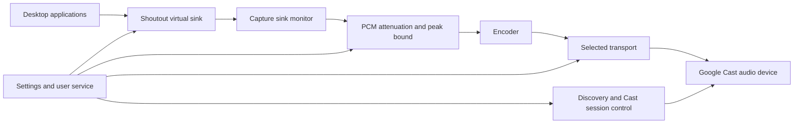

# Implementation plan

Implementation update (2026-09-26): the Go service, continuous MP3 playback, discovery, KDE output, volume scaling, preset controls, settings UI, and per-user installer are implemented and running. See [validation](VALIDATION.md) for evidence and limits. The architecture below remains the design reference; native distro packages, alternative encodings, and latency tuning remain future work.

## Scope and priorities

1. Deliver working playback through a normal output named Shoutout in KDE's audio selector.
2. Select a Google Cast audio destination and configure useful volume scaling for sensitive speakers.
3. Provide encoding/buffering presets and install without a compiler, root daemon, or manual audio-server configuration.
4. Once the functional baseline works, measure and optimize delay from an application writing audio to sound at the receiver.

Delivery decision: features first, latency optimization later. Initial buffering is acceptable for development and must be described honestly. Keep queues bounded and volume limits enforced from the first version; defer transport comparisons and latency tuning rather than blocking the rest of the application on a latency target.

Initial scope: one configured destination, stereo audio, a user service, CLI diagnostics, and a simple settings window opened from the application menu. Speaker groups follow individual-device validation; group synchronization can introduce additional buffering. The initial test destination is **Lars Kontor**. Primary use is video and games. Direct mDNS discovery identified it as **Chromecast Audio** on 2026-09-26. Firmware and transport capabilities still need verification during playback testing.

## Host baseline

Inspection on 2026-09-26 found Arch Linux, PipeWire 1.6.9 exposing the PulseAudio protocol, and a 48 kHz stereo default audio format. `pactl`, `parec`, `pw-cat`, FFmpeg, Go, and Rust are installed. The installed FFmpeg exposes PulseAudio capture and MP3, AAC, and FLAC encoders. This establishes local prerequisites, not receiver compatibility or observed KDE menu behavior. Direct mDNS discovery succeeded without the inactive system Avahi daemon; prefer application-owned discovery. No audio settings were changed during planning.

## Language decision

Use Go provisionally. Discovery, Cast control, HTTP streaming, configuration, process supervision, and a user service fit its standard networking and concurrency facilities. Start with a separately supervised system encoder and capture helper so the Go binary does not require native audio or codec bindings. Shipping one application executable still requires packaging its runtime dependencies.

Rust does not inherently lower receiver buffering or codec delay. Reconsider it only if later integration work or latency measurements demonstrate that essential native real-time integration is substantially easier to build and distribute with Rust. Keep allocation-heavy control work outside the PCM processing loop; benchmark the latter before optimizing it.

## Latency optimization follows the functional baseline

The following targets guide the later optimization milestone and are not prerequisites for delivering features. For Interactive mode, target p95 end-to-end delay of 100 ms or less as an aspirational engineering goal, not a compatibility claim; even this may be noticeable in games. For Video mode, use 250 ms as the initial uncompensated budget and measure whether player-side video delay is needed. These are provisional design budgets, not user-approved tolerances or demonstrated results. Aim for under 50 ms of host-controlled capture, processing, and queueing overhead, measured separately from receiver delay. These provisional budgets help detect regressions; do not label a multi-second path low latency merely because host overhead is small.

Measure cold-start time, warm-start time, steady-state delay (median and p95), drift after 30 minutes, dropouts, and volume/mute response time. Use at least 30 low-level impulses or a correlation signal per configuration. Capture the source reference and receiver output on a common clock where possible (dual-channel loopback/line-in); otherwise document microphone/acoustic and clock uncertainty. Cast status timestamps and ping time cannot substitute for audible end-to-end measurement. Begin hardware tests muted and ramp a quiet test signal deliberately.

For initial playback, start with continuous HTTP MP3 and use segmented delivery if needed for reliable receiver compatibility. Keep transport ownership separate from settings, capture, and Cast control so later changes do not require rebuilding those features. After the functional baseline, compare:

- Continuous HTTP audio: start with MP3, then test receiver-supported AAC and FLAC containers. Verify genuinely unbounded playback, MIME handling, reconnects, and measured buffering; codec support alone does not establish live-stream support.
- Segmented streaming: measure its segment and receiver buffering cost. It may serve as the initial working transport, but do not label it low latency without evidence.
- Real-time Cast Streaming: investigate audio-only negotiation and actual receiver support during optimization if HTTP misses the goal. Account for session negotiation, codec negotiation, timing, encrypted media transport, receiver feedback, and retransmission; it is a distinct transport, not an HTTP tuning flag.

Using a custom receiver would add deployment/registration requirements and may not work on the intended audio hardware. Receiver buffering controls exposed to receiver applications are not automatically controllable by a sender using the default receiver. Validate these constraints before committing to that route.

The optimization milestone ends with a measured transport/codec selection for the actual device. If no supported path meets the goal, record the attainable floor and limitations for video/games. Preserve the working feature set and do not silently claim that latency goals were met.

## Audio and control flow

### Virtual output and KDE

Create an owned `module-null-sink` through PipeWire's PulseAudio interface with a stable name, friendly description, stereo layout, and appropriate icon properties. KDE should enumerate it through its normal audio backend; verify that on a live Plasma session. No kernel driver or KDE plugin is expected.

Capture only this sink's monitor, explicitly pinning the capture stream so changing the default device does not redirect capture. Preserve the user's existing routing until they select Shoutout. Start at 48 kHz and avoid needless resampling. Track owned module IDs, prevent duplicate service instances, reconcile stale owned sinks after a crash, and recreate the sink after audio-server restart. Remove only resources owned by Shoutout on clean shutdown.

Keep the configured sink available during short network outages, with a visible disconnected state in settings. Discard stale audio during disconnection; never play a backlog on reconnect. Test the desktop's fallback routing when the service stops.

### Discovery and Cast control

Discover `_googlecast._tcp.local` using mDNS; persist device identity independently of its friendly name and current IP. Allow explicit host/port configuration when discovery is unavailable. Use advertised ports, including for groups. Select the local interface/address using the route to the chosen receiver, with a user override for VPNs and multiple interfaces.

Own the Cast connection, message framing, request correlation, heartbeats, receiver launch/load/status, device volume, and shutdown. Use deadlines, cancellation, bounded retries, and session ownership. If another controller takes over, stop gracefully instead of repeatedly reclaiming the device. Handle suspend/resume and receiver address changes. A Cast destination must be able to reach the source machine for HTTP media delivery.

### Audio pipeline and transport

Proposed prototype path: `parec` emits explicitly formatted PCM from the monitor; Go applies attenuation; FFmpeg consumes PCM on stdin and emits the selected stream. A direct FFmpeg capture experiment can establish the initial transport baseline, but the product needs enforceable PCM scaling. Measure the extra process/pipe overhead. Use native capture only if measurements justify the added integration cost.

Use bounded queues, timestamp samples/frames, expose queue age, and discard old data at safe frame boundaries. Restart a stale receiver session where necessary rather than growing latency indefinitely. Avoid whole-file buffering and arbitrary startup sleeps. Warm sessions may send silence while selected to reduce startup delay; make session retention an explicit policy so idle service does not claim a speaker forever.

For HTTP, start the server before loading the media URL, send correct content types and live-stream semantics, flush promptly, and support receiver request behavior established by testing. Disconnect slow consumers without blocking capture. Bind only the intended network interface, use a per-session unguessable media URL, and redact it from logs. Keep configuration access separate and local. Group access rules require separate testing. Explain firewall requirements without modifying the firewall automatically.

### Volume scaling

Keep three concepts separate in settings: desktop volume, stream attenuation, and receiver volume ceiling. The desktop slider normally controls sink gain; do not apply that gain twice in the PCM path. Verify actual monitor gain/mute semantics experimentally.

Apply a configurable non-positive trim in dB before encoding: amplitude multiplier = `10^(trim_db/20)`. For example, -30 dB is approximately 0.0316 of input amplitude, and -20 dB is 0.1. Use float PCM and bound output peaks so desktop amplification above 100% cannot defeat the configured stream ceiling. A peak clamp is a last-resort bound and may distort; calibrate the useful range and add a limiter only if needed.

Provisional onboarding defaults: -40 dB stream trim, receiver volume 1%, absolute receiver ceiling 5%, and muted until the user completes quiet calibration. These are starting values, not a guaranteed sound-pressure limit. Never set the receiver to full volume as part of connecting. Confirm a muted or bounded receiver state before serving non-silent PCM. Reconnect and device switching must preserve limits and fade in without a full-level burst.

Keep desktop volume local in the first version; do not mirror its 0–100% range directly to hardware volume. This preserves slider resolution inside an attenuated listening range. If hardware volume changes externally, report it and reconcile the configured ceiling while this session owns playback. Local attenuation remains necessary because remote volume updates are asynchronous. Offer immediate receiver mute as well as local mute, since already-buffered audio can outlast a local mute command.

### Configuration and user experience

Store versioned configuration under `$XDG_CONFIG_HOME/shoutout/`, falling back to `~/.config/shoutout/`; store transient state under the user runtime directory. Validate changes and save atomically. Settings include destination ID/manual endpoint, output label, trim in dB, receiver ceiling, startup mute, network interface/port, latency profile, and start-at-login.

Provide planned commands `shoutout devices`, `shoutout configure`, `shoutout status`, `shoutout doctor`, and `shoutout run`. A desktop entry opens a loopback-only settings page served by the Go application, avoiding a GUI toolkit runtime. Protect changes with a local session token and origin checks. Show connection state, destination, volume settings, and measured/estimated latency with clear labels; do not present network RTT as audio latency.

Provide a preset dropdown plus an Advanced panel during feature development. Initially expose supported encoding/buffering settings and label unmeasured profiles as experimental. Tune presets using measurements in the later optimization milestone; the policies below describe their intended behavior:

| Preset | Policy |
| --- | --- |
| Interactive | Smallest stable measured capture and transport buffers; prioritize games; no silent fallback to a multi-second path. Report when the receiver cannot meet the target. |
| Video | Prefer low delay with modest jitter tolerance; display measured audio delay and guidance for players that support delaying video. A virtual sink cannot automatically synchronize arbitrary games or video applications. |
| Music | Allow larger buffers for reliability and higher-quality encoding; explicitly show the increased delay. |
| Custom | Advanced codec/container, bitrate, sample rate and supported buffer controls; validate combinations and show when a change restarts playback. |

Presets are device-specific profiles, not universal hard-coded latency promises. Show only formats verified or explicitly marked experimental for that receiver. Distinguish user-controlled capture/queue settings from opaque receiver buffering. Persist the preset and any custom overrides per destination. Apply configuration changes muted and fade in under the existing volume limit.

First-run flow: discover/select destination, choose a preset and conservative volume settings, run a quiet test, then explain selecting Shoutout in KDE. No account login should be required for normal local operation. Diagnostics should identify absent capture/codec tools, discovery failure, unreachable media URL, and unsupported playback separately.

## Proposed code boundaries

| Package | Responsibility |
| --- | --- |
| `cmd/shoutout` | CLI and process entry point |
| `internal/config` | Validated settings and atomic persistence |
| `internal/audio` | Sink ownership, capture, gain and queue bounds |
| `internal/discovery` | Device identities, mDNS and address resolution |
| `internal/cast` | Control protocol and session lifecycle |
| `internal/stream` | Encoder lifecycle and selected media transport |
| `internal/service` | Cancellation, reconnect and state transitions |
| `internal/settings` | Embedded local settings UI |

Start with concrete types and small consumer-owned interfaces at replaceable I/O boundaries. All goroutines and subprocesses need explicit cancellation and cleanup. Add packages as working features require them; do not scaffold unused abstractions for speculative transports.

## Delivery sequence and acceptance

| Milestone | Deliverable | Exit criteria |
| --- | --- | --- |
| 1. Working playback | Go daemon, selectable sink, one destination, attenuation, live audio | Lars Kontor plays continuously; KDE lists output; per-app routing works; volume and mute behavior verified; no latency threshold required |
| 2. Configuration and resilience | Discovery, destination selection, persisted config, reconnects, bounded queues, diagnostics | Recover from network loss, receiver restart, audio-server restart and suspend without stale audio or volume bursts |
| 3. Settings and installation | Preset dropdown, advanced encoding/buffering controls, settings UI, desktop entry, user service, packages | Fresh install through packaged dependencies; no compiler; configure destination and volume through GUI; profiles accurately label unmeasured latency; clean uninstall |
| 4. Latency optimization | End-to-end measurements, tuned buffers/codecs, transport comparison where justified | Record cold/warm startup, median/p95 delay, drift and dropouts on Lars Kontor; tune device presets and report achievable limits |
| 5. Release validation | CI, signed/checksummed artifacts and compatibility matrix | Repeatable clean builds; hardware/distro results published; known latency limits explicit |

## Packaging and validation

Start with Arch packaging for the current environment, then Debian/Ubuntu packages and portable Linux amd64/arm64 archives. Declare PipeWire's PulseAudio service, capture/control utilities, and an FFmpeg build with the selected encoder as dependencies; add a preflight check for actual capabilities. Keep a native binary build free of cgo if the selected transport permits it. Provide a systemd user service with bounded restart behavior, start-at-login toggle, and matching install/uninstall instructions. Avoid requiring system-wide audio configuration edits. Sandbox packaging is a later decision because audio access, mDNS and inbound LAN streaming must all work.

When implementation starts, CI should run formatting checks, `go test ./...`, `go vet ./...`, and race tests for concurrent state/stream code. Test gain boundaries (including invalid/non-finite settings), muted startup, reconnect ordering, queue limits, cancellation, malformed Cast frames, and config migrations. Use protocol simulations for timeouts/takeover; fuzz framing and config parsers. Hardware validation remains separate from unit tests.

Release checks: clean installation on supported distros; output selectable in Plasma; quiet calibration; 30-minute delay/drift run; deliberate packet loss/disconnection; restart/suspend recovery; zero stale backlog; complete uninstall. Record device model/firmware, codec, format, connection type, buffering parameters, and measurement uncertainty. Playback and the per-user installer have been exercised locally; measured latency, long-duration drift, and fresh distro installation remain outstanding. See [validation](VALIDATION.md).

## Platform references

- [PipeWire null sink options](https://docs.pipewire.org/page_pulse_module_null_sink.html) and [module loading](https://docs.pipewire.org/page_pulse_modules.html).
- [FFmpeg PulseAudio capture documentation](https://ffmpeg.org/ffmpeg-devices.html#pulse).
- [Google Cast supported media](https://developers.google.com/cast/docs/media): supported formats vary by device; live delivery still requires testing.
- [Google Cast receiver overview](https://developers.google.com/cast/docs/web_receiver) and [receiver playback controls](https://developers.google.com/cast/docs/reference/web_receiver/cast.framework.PlaybackConfig).
