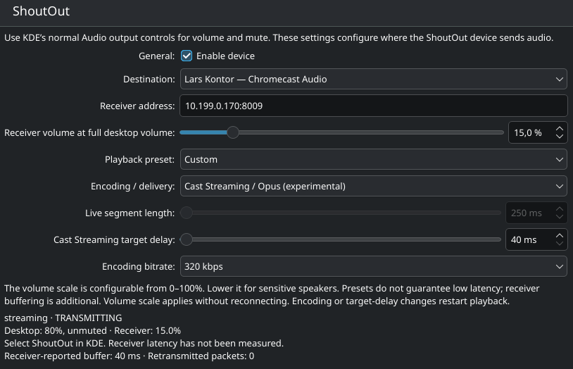

# ShoutOut

**Use your Google Audio compatible speakers for system audio**

ShoutOut turns a Google Cast speaker into a Linux audio output. On **Omarchy** or **KDE Plasma**, select the ShoutOut output in your desktop audio controls and send sound from your games, browser, music player—or your whole desktop.



- **Feels native.** Omarchy: a shell bar widget plugin. KDE: a System Settings page. Volume and mute are the ShoutOut output in the desktop audio controls (Omarchy Audio panel or KDE).
- **Speakers appear automatically.** Live discovery keeps your destination list up to date.
- **Choose your balance.** Low latency, Balanced and High quality presets, plus custom controls.
- **Tame sensitive speakers.** Adjustable volume scaling, applied without interrupting playback.

| Preset | Playback |
|---|---|
| Low latency | Opus · 128 kbps · 20 ms receiver target |
| Balanced | Opus · 192 kbps · 100 ms receiver target |
| High quality | AAC · 320 kbps |

Receiver targets are buffer settings, not total audible latency. Playback is tested on Chromecast Audio; Cast Streaming is experimental.

## Get started

ShoutOut needs **PipeWire** with PulseAudio compatibility on either desktop. Settings and install steps differ; see [requirements and installation details](GUIDE.md).

**Omarchy** — build and install for your user:

```sh
make build
./build/shoutout install
shoutout configure
```

This installs the daemon, user systemd service, and the Omarchy shell bar plugin (`io.github.lkarlslund.shoutout`). `shoutout configure` opens that panel when `omarchy-shell` is on PATH.

**KDE Plasma 6** — on Arch Linux, use the [system-wide package](ARCH.md) (KDE module only; it does not install the Omarchy plugin):

```sh
make package-install
shoutout configure
```

Or build from source with Go, FFmpeg and the Qt6/KDE development libraries:

```sh
make build kde
./build/shoutout install
shoutout configure
```

Choose your speaker, select **ShoutOut** as your audio output, and unmute (Omarchy Audio panel or KDE). Start with a low volume scale for sensitive speakers.

`shoutout configure` opens settings immediately when supported (`omarchy-shell … open` on Omarchy, otherwise the KDE System Settings module). Per-user KDE source installs need a new login for discovery through the normal System Settings launcher. Arch packages are discoverable immediately.

[Usage & troubleshooting](GUIDE.md) · [Development plan](PLAN.md) · [Validation](VALIDATION.md)

[MIT licensed](../LICENSE). [Third-party notices](DEPENDENCIES.md).
